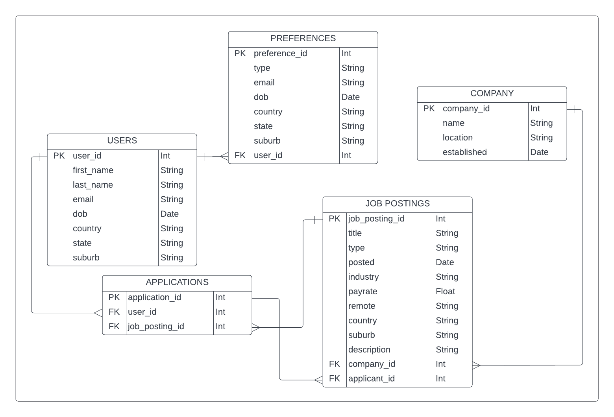

# T2A2 API server

Here is the API server that I am making.

## ERD Diagram

## Route approach

Route: `/` information on how to use the api and display it in JSON format.

Route: `/applications` display the users applications. # IF user (GET, DELETE, PUT)

Route: `/applications` display the companies job postings applications. # IF company (GET, PUT, DELETE)

Route: `/login` the page to login for both user. (POST)

Route: `/register` the page to register for both user. (POST)

Route: `/jobs` will contain all the jobs and take in a query to filter. (GET)

Route: `/jobs/<int:job_id>` will have information about the specific job. (GET)

Route: `/jobs/<int:job_id>/apply` will allow any user to post an application. (POST)

Route: `/jobs/new` will only allow companies to post a new job listing. (POST)

Route: `/jobs/edit` allow companies to edit the information on the job posting. (PUT, DELETE)

Route: `/admin` allow the user to edit their preferences. (GET, PUT)

Route: `/company` display the various companies that have job postings. (GET)

Route: `/company/<string:name>` show the individual company profile. (GET)

Route: `/company/edit` allow the company to edit their information. (PUT, DELETE)
